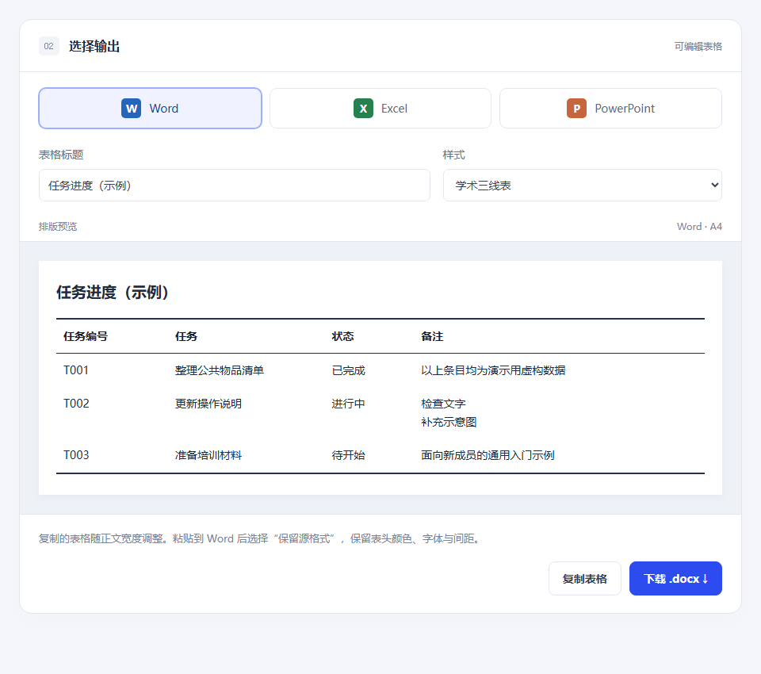
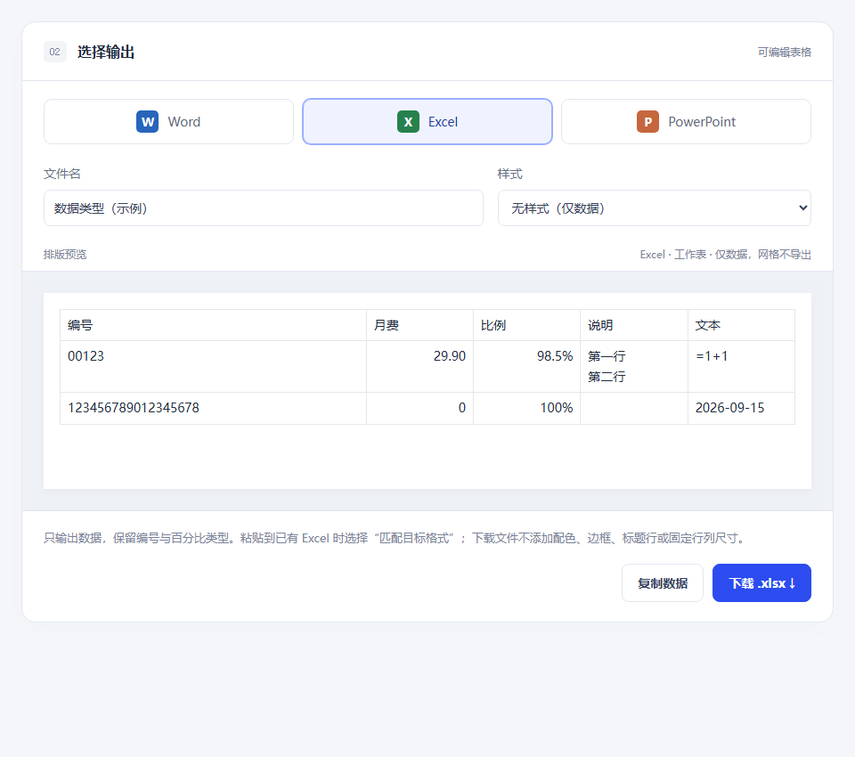
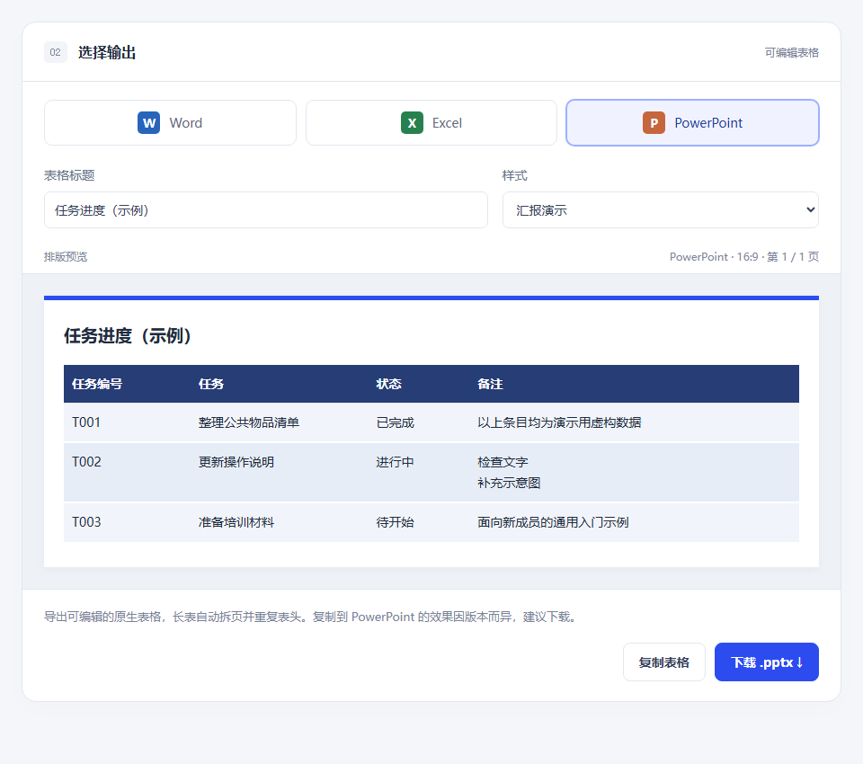

# 表格工坊 · Table Workshop

把 AI / Markdown 表格整理成适合 Word、Excel 和 PowerPoint 的可编辑表格。表格内容只在本机浏览器处理。

[English](README.en.md) · [下载版本](https://github.com/peta-webster/table-workshop/releases) · [示例输入](examples/README.md) · [兼容性记录](docs/compatibility.md)

## 快速开始

安装 [Node.js](https://nodejs.org/) 22 或更高版本，然后运行：

```sh
git clone https://github.com/peta-webster/table-workshop.git
cd table-workshop
npm start
```

打开终端显示的 `http://127.0.0.1:4173/`，并保持终端运行。启动无需先安装 npm 依赖。也可以从 [Releases](https://github.com/peta-webster/table-workshop/releases) 下载网页运行包，解压后运行 `node scripts/serve.mjs`。

## 使用方法

1. 粘贴一张 Markdown 表格、网页 HTML 表格或简单制表符文本。
2. 选择 Word、Excel 或 PowerPoint，再选择样式。
3. 复制表格，或下载可编辑的 Office 文件。


### 三种输出的网页预览

以下图片由本地应用和虚构示例生成，展示网页排版预览；实际 Office 显示可能不同。点击图片可查看原图。

| Word · 学术三线表 | Excel · 无样式（仅数据） | PowerPoint · 汇报演示 |
| --- | --- | --- |
| [](docs/screenshots/word-preview.png) | [](docs/screenshots/excel-preview.png) | [](docs/screenshots/powerpoint-preview.png) |
| [任务进度示例](examples/project-status.md) | [数据类型示例](examples/data-types.md) | [任务进度示例](examples/project-status.md) |

## 各目标软件的用法

| 目标 | 输出与粘贴建议 |
| --- | --- |
| Word | 下载原生 `.docx`，或复制后在 Word 中选择「保留源格式」。剪贴板表格宽度随正文区域调整。 |
| Excel | 默认「无样式（仅数据）」。编号、前导零、长数字和公式样式输入保留为文本；明确的数字和百分比保持数值。粘贴到已有工作表后选择「匹配目标格式」。 |
| PowerPoint | 下载原生可编辑 `.pptx`。长表按行高拆页并重复表头；跨应用粘贴效果取决于 Office 版本。 |

Excel 的「匹配目标格式」也会采用目标单元格的数字显示格式。需要保持原始百分比或小数位显示时，下载 `.xlsx`。

## 范围与验证

- 一次处理一张矩形表格，最多 30 列、10,000 个数据单元格；PowerPoint 最多 10 列。
- 不支持合并单元格、复杂富文本或原生数学公式。简单制表符输入不等同于完整 CSV / 带引号 TSV 导入。
- 自动测试检查输入、数据类型、剪贴板和 Office 文件结构。真实 Office 粘贴与排版的已测范围见[兼容性记录](docs/compatibility.md)；Windows Office 和 WPS 仍待实测。

## 开发与仓库结构

```sh
npm ci
npm test
npm run build
npm run package
```

| 目录 | 内容 |
| --- | --- |
| `src/` | 页面、表格解析、Office 导出及固定版本的浏览器依赖 |
| `scripts/` | 本地服务、静态构建和运行包生成 |
| `tests/` | 回归测试 |
| `examples/` | 可复制的虚构输入与示例索引 |
| `docs/` | 兼容性记录与网页预览截图 |

构建结果位于 `dist/`，可部署到静态 HTTPS 托管服务。项目无账号、转换后端、AI API、分析统计或运行时 CDN 请求；托管服务仍会收到普通网页请求。

参与方式见[贡献指南](CONTRIBUTING.md)、[行为准则](CODE_OF_CONDUCT.md) 和[更新记录](CHANGELOG.md)。项目代码采用 [MIT 许可证](LICENSE)，第三方库声明见[第三方声明](THIRD_PARTY_NOTICES.md)。
